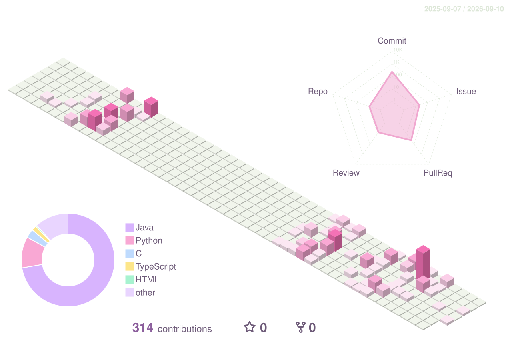

### 기록하고, 연결하고, 더 나은 구조를 고민하는 개발자 강지윤입니다.

백엔드 개발을 중심으로  
AI 서버 연동, 외부 API, IoT/oneM2M 구조를 공부하고 있습니다.

 

---

## ☁️ About Me

- Java & Spring Boot 기반의 백엔드 개발을 합니다.
- 인증/인가, 소셜 로그인, AI 서버 연동을 구현해봤습니다.
- Python 기반 Federated Learning과 oneM2M 구조를 공부하고 있습니다.
- 협업 과정에서 **가독성 좋은 코드와 유지보수 가능한 구조**를 중요하게 생각합니다.

---

## 🪻 Tech Stack

### Backend

  
  
  
  

### Database & Infra

  
  
  
  

### Tools

  
  
  
  

---

## 🌙 Featured Projects

| Project | Description | Tech |
|:---|:---|:---|
| [eodaego-BE](https://github.com/eodaego/eodaego-BE) | AI 기반 여행 코스 추천 서비스 백엔드 | Java, Spring Boot, PostgreSQL |
| [DonTouch-BE](https://github.com/TEAM-DonTouch/DonTouch-BE) | 소비 관리 서비스 백엔드 / 소셜 로그인 구현 | Java, Spring Boot, JWT, OAuth |
| [FL](https://github.com/Kangjiyun1234/FL) | oneM2M 환경에서 연합학습과 장애 감지 흐름 실험 | Python, FastAPI |
| [tinyIoT](https://github.com/seslabSJU/tinyIoT) | oneM2M TinyIoT 분석 및 개선 기여 | C, oneM2M |

---

## 📊 GitHub Status

  

---

## 📚 Currently Learning

- Spring Transaction
- OAuth 2.0 & Social Login
- oneM2M Architecture
- Federated Learning
- Testable Backend Design

---

## 💌 Contact

- Email: `YOUR_EMAIL`
- Portfolio: `YOUR_PORTFOLIO_LINK`

---

