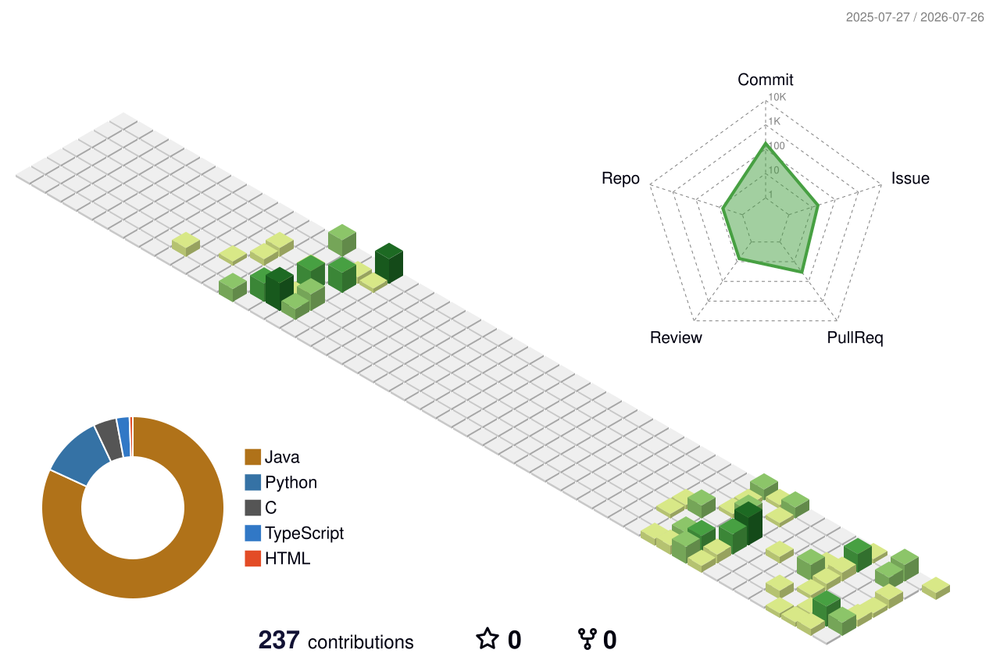

### 안정적인 서비스 흐름을 고민하는 백엔드 개발자 강지윤입니다.

Spring Boot 기반의 백엔드 개발과  
AI 서버·외부 API·IoT 시스템 연동을 공부하고 있습니다.

 

 

## 👋 About Me

- Java와 Spring Boot를 활용해 REST API를 개발합니다.
- 인증·인가, 소셜 로그인, 외부 API 및 AI 서버 연동을 경험했습니다.
- Python 기반 Federated Learning과 oneM2M IoT 구조를 공부하고 있습니다.
- Issue → Branch → Pull Request → Review로 이어지는 협업 과정을 중요하게 생각합니다.
- 동작하는 코드를 넘어 유지보수하기 좋은 구조를 고민합니다.

 

## 🛠 Tech Stack

### Backend

  
  
  
  

### Database & Infrastructure

  
  
  
  

### Collaboration

  
  
  
  

 

## 🚀 Featured Projects

| Project | Description | Tech |
|:---|:---|:---|
| [어대고 BE](https://github.com/eodaego/eodaego-BE) | AI 기반 여행 코스 추천 서비스 백엔드 인증, 외부 API 및 AI 서버 연동 | Java, Spring Boot, PostgreSQL |
| [DonTouch BE](https://github.com/TEAM-DonTouch/DonTouch-BE) | 소비 관리 서비스 백엔드 회원가입과 소셜 로그인 기능 개발 | Java, Spring Boot, JWT, OAuth |
| [Federated Learning](https://github.com/Kangjiyun1234/FL) | oneM2M 환경에서 연합학습과 장애 감지 흐름을 실험하는 프로젝트 | Python, FastAPI, oneM2M |
| [tinyIoT](https://github.com/seslabSJU/tinyIoT) | oneM2M TinyIoT 오픈소스 분석 및 Hybrid Addressing 개선 기여 | C, oneM2M |

 

## 📊 GitHub Status

  

 

## 📚 Currently Learning

- Spring Transaction과 동시성 제어
- OAuth 2.0 및 소셜 로그인 구조
- oneM2M 기반 IoT 시스템
- Federated Learning
- 테스트 가능한 백엔드 아키텍처

 

## 📫 Contact

- Email: `YOUR_EMAIL`
- Blog: `YOUR_BLOG_LINK`
- Portfolio: `YOUR_PORTFOLIO_LINK`

 

